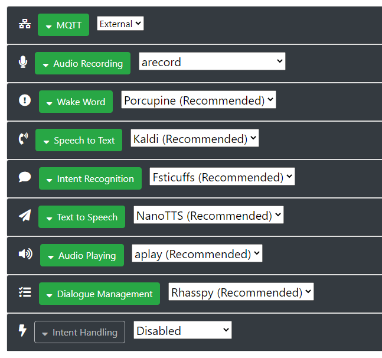

Was ist Rhasspy?  
Rhasspy ist eim Open-Source Sprachassistent.
Es ist ein Programm, welches verschiedene Techniken, unter anderem eine WakeWord-Erkennung, eine Spracherkennung und eine Intent-Erkennung verbindet, sodass es möglich ist, aus einem gesprochenen Satz einen Befehl zu erkennen und zu verarbeiten.  
  
Auf dieser Seite beschreibe ich einige Dinge zu Rhasspy, welche ich genutzt habe, um mein Skillsystem umzusetzen.  
Wie genau kommuniziert meine Anwendung mit der Rhasspy Instanz?  
Wie betreibe ich Rhasspy eigentlich?  

## Neue Intents hinzufügen
**Problem: Wie hinterlegt man die Intents eines Skills bei Rhasspy, sodass die Spracherkennung und die Intent-Erkennung damit arbeiten können?**

Lösung: Ich nutze die [Rhasspy-Api](https://rhasspy.readthedocs.io/en/latest/reference/#http-api), um neue Intents zu hinterlegen und Rhasspy neu zu trainieren.
### Sätze
Neue Sätze/Intents kann man unter ``http://<host-ip>:12101/api/sentences`` registrieren.  
Diese werden dann unter ``<Pfad des Profils>/intents/<Intentname>`` gespeichert.  
Dazu werden folgende Daten mittels einer HTTP-POST-Anfrage an obigen Endpoint gepostet:
````json
{
  "intents/<Name des Intents>.ini" : "[<Name des Intents>]\n<Sätze jeweils mit '\n' separiert>"
}
````

### Slots
Neue Slots kann man unter ``http://<host-ip>:12101/api/slots`` registrieren.  
Dazu wird ein Array mit den einzelnen Alternativen unter dem Slotnamen an obigen Endpoint gepostet:
````json
{
  "slots/<Name des Slots>": [
    "<Alternative 1>", 
    "<Alternative 2>",
    "<Alternative 3>",
    
    "<Alternative n>"
  ]
}
````

## Rhasspy trainieren
Um die Änderungen wirksam zu machen, muss man nach den obigen Anfragen eine weitere Anfrage an folgenden Endpoint senden: ``http://<host-ip>:12101/api/train``  
Dadurch wird Rhasspy's eigene Trainingsroutine gestartet.  
Rhasspy kümmert sich im Hintergrund darum, dass die Spracherkennung die neu hinzugefügten Wörter erkennt und die neuen Sätze von der Intent-Erkennung erfasst und die Intentionen bestimmt werden können.  

## Rhasspy Einstellungen

Für mein vorkonfiguriertes Disk-Image habe ich folgende Einstellungen getroffen:



Dabei handelt es sich fast ausschließlich um die von Rhasspy vorgeschlagenen Einstellungen.  
Lediglich als Audioeingabe habe ich ``arecord`` statt ``pyaudio`` verwendet, da es mit meinem Mikrofon besser funktioniert hat.  

Die zwei wichtigsten Einstellungen sind jedoch ``MQTT`` und ``Intent Handling``.  
Der Punkt ``MQTT`` muss auf ``External`` stehen und auf einen separaten MQTT-Broker verweisen, da auch mein Skillmanager auf diesen zugreifen muss.  
Und ``Intent Handling`` sollte ``Disabled`` sein, da mein Skillmanager sich darum kümmert und so die Intents von Rhasspy übergeben bekommt.