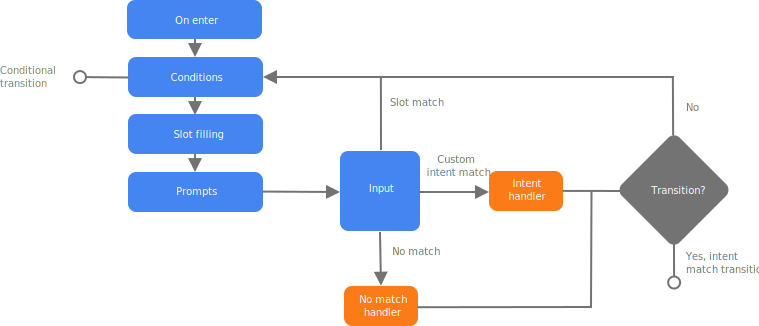
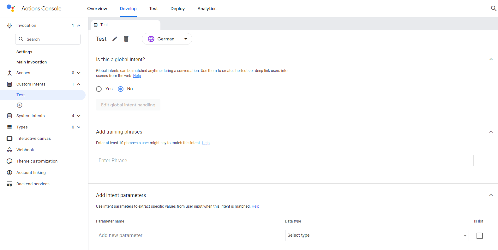

Beim Google Assistant heißen die Funktionen Actions.  
Actions können auf viele verschiedene Arten erstellt und verwendet werden.  
Ich habe mich hier auf die Variante über die Actions Console und das Actions-SDK beschränkt.  
Allerdings sind mit dieser Variante die Möglichkeiten sehr eingeschränkt und eher auf eine einfache Konversation ausgelegt.  
Für mehr Funktionen gibt es wesentlich bessere Möglichkeiten eine Action zu erstellen (z.B. Über [DialogFlow](https://dialogflow.cloud.google.com/#/getStarted) und [Cloud Functions or Firebase](https://firebase.google.com/docs/functions)).  
Allerdings lässt sich bei Diesen der Aufbau der Dateien nicht erkennen und sind somit nicht hilfreich, wenn ich versuche eine eigene Ordnerstruktur zu erstellen.

## Befehlsstruktur

Bei Google Actions gibt es keine "richtige" Befehlsstruktur, vielmehr verschiedene Varianten einen Satz zu interpretieren.  
Google nutzt nämlich eine NLU-Technik (**N**atural **L**anguage **U**nderstanding), um aus einem Set aus Sätzen ein KI-Modell zu generieren.  
Anhand dieses Modells kann der Google Assistant dann ermitteln, um welche Action es sich handelt.  

### Beispiel

Um das KI-Modell zu trainieren, muss man verschiedene [Trainingssätze](https://cloud.google.com/dialogflow/es/docs/intents-training-phrases?hl=en) generieren:  

- "I like red"
- "My favorite color is yellow"
- "black"
- "Blue is my favorite"
- ...

Google versucht mittels eines eigenen vortrainierten KI-Modell, alle Slots aus den Trainingssätzen herauszufiltern.  
Für komplexere Slots kann man jedoch über die [Actions Console](#actions-console) die einzelnen Werte (wie zum Beispiel ``black`` oder ``Blue``) markieren und annotieren.  
Hat man die benötigte Menge an Trainingssätzen erstellt und vorbereitet, kann ein Befehl wie folgt aussehen:  
  
"OK Google, green, that's my favorite color."


## Ordnerstruktur 

Da Google Actions eine große Vielfalt an Funktionen bieten soll, gibt es auch hier wieder einige Verzeichnisse, die ich nicht näher beschreiben werde.  
Dabei handelt es sich um Funktionen, die ich aufgrund des Umfangs nicht umsetzen kann.  

Die vollständige Ordnerstruktur: 
````
<Action-Verzeichnis>   
│
├── actions/
├── custom/
│   ├── global/
│   ├── intents/
│   ├── prompts/
│   ├── scenes/
│   └── types/
├── resources/
│   └── images/
├── settings/
├── webhooks/
│   └── Fulfillment/
└── manifest.yaml
````

Die von mir beschriebenen Verzeichnisse:  
````
<Action-Verzeichnis>   
│
├── actions/          ->  Startpunkt einer Action
├── custom/
│   ├── global/       ->  Wenn ein Intent zu jedem Zeitpunkt einer Konversation erkannt werden soll, definiert man das unter diesem Verzeichnis
│   ├── intents/      ->  Hier können dann die eigenen Intents definiert werden
│   ├── scenes/       ->  Szenen legen eine Art Pfad fest, der abhängig von erkannten Intents "abgelaufen" wird
│   └── types/        ->  Hier werden Slots definiert
└── webhooks/
    └── Fulfillment/  ->  Unter diesem Verzeichnis befindet sich der tatsächliche Code, der von der Action ausgeführt wird
````

[//]: # (- ``actions/actions.yaml``: Startpunkt einer Action)

[//]: # (- ``custom``:)

[//]: # (  - ``global``: Wenn ein Intent zu jedem Zeitpunkt einer Konversation erkannt werden soll, definiert man das unter diesem Verzeichnis)

[//]: # (  - ``intents``: Hier können dann die eigenen Intents definiert werden)

[//]: # (  - ``scenes``: Szenen legen eine Art Pfad fest, der abhängig von erkannten Intents "abgelaufen" wird)

[//]: # (  - ``types``: Hier werden Slots definiert)

[//]: # (- ``webhooks``: Unter diesem Verzeichnis befindet sich der tatsächliche Code, der von der Action ausgeführt wird)

Die Erstellung und der Aufbau der einzelnen Actions weichen stark von der, der [Skills (Amazon Alexa)](./amazonalexa.md) ab.

### Intents

Um einen neuen Intent anzulegen, muss man zunächst die Sätze definieren, durch die der Intent erkannt werden kann.  
Dazu legt man eine Datei unter ``<Action-Verzeichnis>/custom/intents/`` mit dem gewünschten Namen des Intents an.  
In dieser Datei speichert man dann unter dem Schlüssel ``trainingPhrases`` eine Liste mit den gewünschten Ausdrücken:  

````yaml
trainingPhrases:
  - help me
  - I need some help
  - Help
````
*Auszug aus der offiziellen [Dokumentation](https://developers.google.com/assistant/conversational/build/deep-link-invocations?tool=sdk#create_deep_link_invocations)*

Damit der Google Assistant weiß, wie er mit diesem Intent umzugehen hat, legt man eine zweite Datei mit gleichem Namen unter dem Verzeichnis ``<Action-Verzeichnis>/custom/global/`` an.  
Hier wird definiert, was nach der Erkennung des Intents passieren soll.  
In folgendem Beispiel soll einfach eine Szene gestartet werden:  

````yaml
transitionToScene: global_intent_scene
...
````
*Auszug aus der offiziellen [Dokumentation](https://developers.google.com/assistant/conversational/build/deep-link-invocations?tool=sdk#create_deep_link_invocations)*

### Szenen

Eine Szene kann durch einen erkannten Intent gestartet werden.  
Befindet sich der Google Assistant in einer Szene, werden einige Aktionen ausgeführt, bis die Szene abgeschlossen ist und die Nutzerin oder der Nutzer das gewünschte Ergebnis erhält.  

Über Szenen werden fehlende Slots abgefragt und Sprachausgaben in einer Warteschlange abgelegt.  
Sind alle benötigten Angaben vorhanden und die Warteschlange abgearbeitet, wird der eingehende Intent behandelt.  
Danach wird in eine andere Szene übergegangen oder die normale Sprachaktivierung wieder gestartet.  
  
Um eine neue Szene zu erstellen, muss man eine Datei im Verzeichnis ``<Action-Verzeichnis>/custom/scenes/`` erstellen.  
Mit ``onEnter`` kann man dann festlegen, was passieren soll, wenn die Szene geladen wird.  
Im folgenden Beispiel wird ein einfacher Satz per Sprachausgabe ausgegeben:

````yaml
onEnter:
  staticPrompt:
    candidates:
    - promptResponse:
        firstSimple:
          variants:
          - speech: This message is sent to the user when the scene loads
````
*Auszug aus der offiziellen [Dokumentation](https://developers.google.com/assistant/conversational/build/conversation?tool=sdk#define_one-time_setup)*  

  
*Bild aus der offiziellen [Dokumentation](https://developers.google.com/assistant/conversational/scenes#execution_lifecycle)*

### Slots

Slots werden unter ``<Action-Verzeichnis>/custom/types/`` definiert.  
Dazu muss man eine Datei mit dem Namen des Slots erstellen.

````yaml
synonym:
  entities:
    boba:
      synonyms:
      - Boba Special
      - boba special
      - Boba
      - boba
    matcha:
      synonyms:
      - Matcha
      - Matcha Tea
      - matcha
      - matcha tea
````
*Auszug aus der offiziellen [Dokumentation](https://developers.google.com/assistant/conversational/build/conversation?tool=sdk#define_slot_filling)*  


Durch obiges Beispiel werden zwei Slots mit den Namen ``boba`` und ``matcha`` und den unter ``synonyms`` angegebenen Werten definiert.  

### Webhooks

Damit sich die Funktionen einer Action nicht nur auf simple Sprachausgaben beschränken, kann man unter dem Verzeichnis ``<Action-Verzeichnis>/webhooks/`` Code definieren, der ausgeführt wird, sobald ein solcher Prozess von einer Szene angestoßen wird.  
Dabei handelt es sich um JavaScript-Code, welcher mittels Google-eigener Funktionen auf diese Webhooks "hört".  

Um einen Webhook zu definieren, benötigt man eine Datei Namens ``ActionsOnGoogleFulfillment.yaml``:   

````yaml
handlers:
  - name: questionOnEnterFunc
  - name: fruitSlotValidationFunc
inlineCloudFunction:
  executeFunction: ActionsOnGoogleFulfillment
    
````
*Auszug aus der offiziellen [Dokumentation](https://developers.google.com/assistant/conversational/webhooks?tool=sdk#development_options)*

Der eigentliche Code befindet sich dann unter dem Verzeichnis ``<Action-Verzeichnis>/webhooks/ActionsOnGoogleFulfillment``.  
Dazu legt man die beiden - für NodeJS typischen - Dateien ``index.js`` und ``package.json`` an:  

````javascript
const {conversation} = require('@assistant/conversation');
const functions = require('firebase-functions');

const app = conversation();

app.handle('questionOnEnterFunc', conv => {
  conv.add('questionOnEnterFunc triggered on webhook');
});

app.handle('fruitSlotValidationFunc', conv => {
  conv.add('fruitSlotValidationFunc triggered on webhook');
});

exports.ActionsOnGoogleFulfillment = functions.https.onRequest(app);
````
*Auszug aus der offiziellen [Dokumentation](https://developers.google.com/assistant/conversational/webhooks?tool=sdk#development_options)*


Wie üblich stehen in der ``package.json`` eine Beschreibung des NodeJS-Projekts und die benötigten ``dependencies``.  
Google Actions nutzen einige [Firebase](https://firebase.google.com/)-Ressourcen und ein Google-eigenes Package, um mit dem Sprachassistenten zu kommunizieren:  

````json
{
  "name": "ActionsOnGoogleFulfillment",
  "version": "0.1.0",
  "description": "Actions on Google fulfillment",
  "main": "index.js",
  "dependencies": {
    "@assistant/conversation": "^3.0.0",
    "firebase-admin": "^5.4.3",
    "firebase-functions": "^0.7.1"
  }
}
````
*Auszug aus der offiziellen [Dokumentation](https://developers.google.com/assistant/conversational/webhooks?tool=sdk#development_options)*


## Actions Console

Bei Actions Console handelt es sich um eine UI-basierte IDE, welche direkt über einen Browser abrufbar ist.  
Hier kann man dann neue Projekte erstellen.  
Dazu kann man zu Beginn eine Kategorie und somit ein vorgefertigtes Template auswählen, wodurch eine einfache Action mit einigen Intents und Sätzen angelegt wird.  
Man hat jedoch auch die Möglichkeit ein leeres Projekt anzulegen, wenn keine der Kategorien auf die eigene Anwendung passt.  
Wenn man die Actions-Console nutzen möchte, braucht man sich um die Ordnerstruktur keine Gedanken zu machen, da alle Dateien von der IDE angelegt werden und man beim Erstellen der Skills und Slots stark an die Hand genommen wird.  



*Screenshot der [Actions Console](https://console.actions.google.com/)*

## Deprecated

Google plant zum 13. Juni 2023 die [Conversational Actions](https://developers.google.com/assistant/conversational/overview) und zum 13. September 2023 die [Actions Console Analytics](https://developers.google.com/assistant/console/analytics) abzuschalten.  
Diese gelten daher bereits jetzt als "deprecated".

## Quellen

[Google Assistant Dokumentation](https://developers.google.com/assistant)  
[Google I/O'19](https://www.youtube.com/watch?v=dpNrq_wiqGs&t=1s)  
[Behind the Actions](https://www.youtube.com/playlist?list=PLOU2XLYxmsIKP4Hh9gQO54naZ8V7mDEQi)